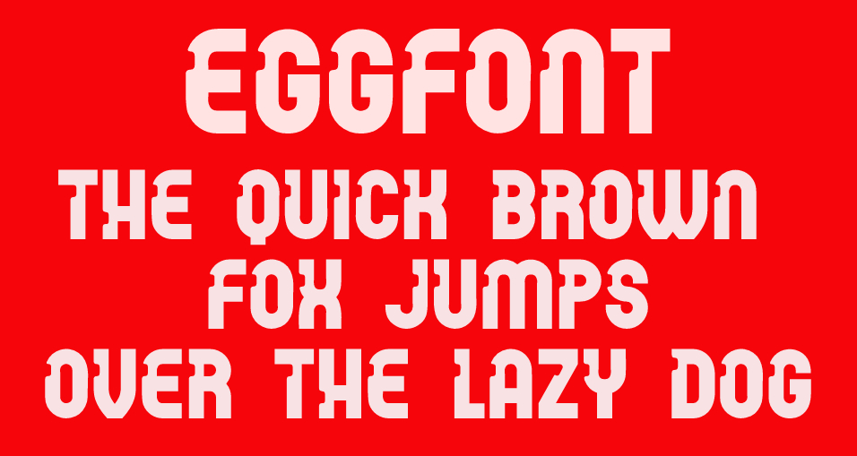

# Eggfont

An egg is an organic vessel grown by an animal to carry a possibly fertilized egg cell (a zygote) and to incubate from it an embryo within the egg until the embryo has become an animal fetus that can survive on its own, at which point the animal hatches.

## Variable Font Axe

Eggfont has the following axe:

  Tag | Default | Static Instances
--- | --- | ---
  wght | 400 | Regular

## Image License
The images in this repository are licensed under the CC https://creativecommons.org/licenses/by-sa/4.0/

## License
This Font Software is licensed under the SIL Open Font License, Version 1.1.
This license is available with a FAQ at [https://openfontlicense.org](https://openfontlicense.org)
